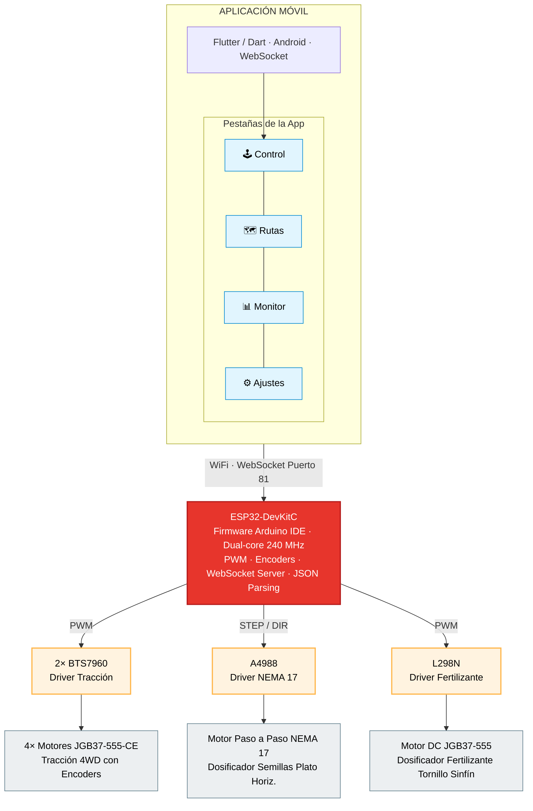
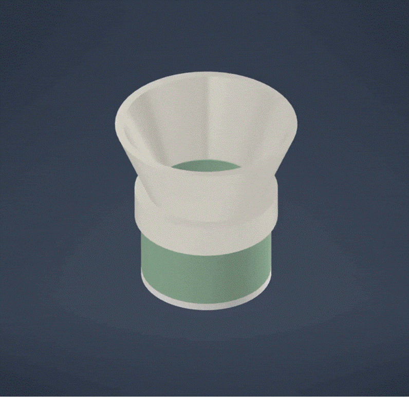
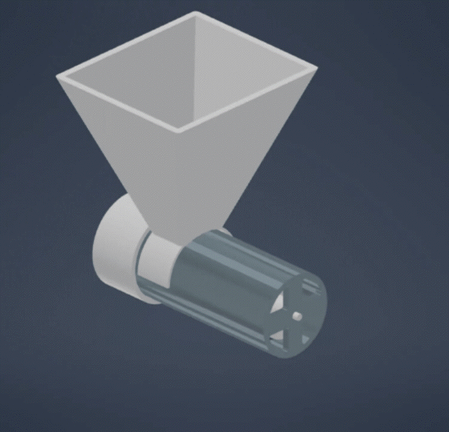
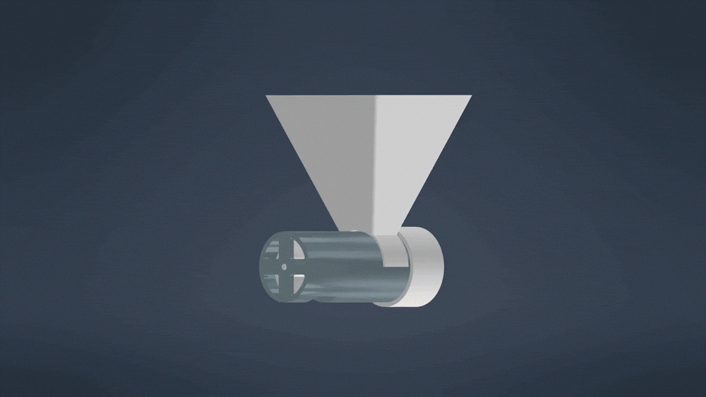
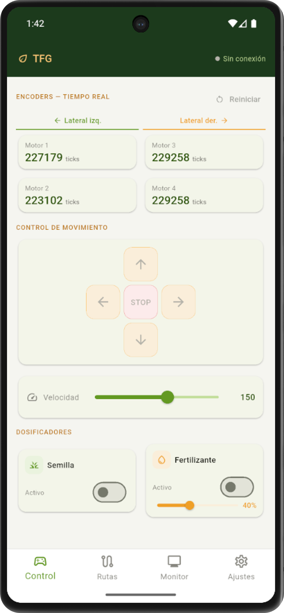
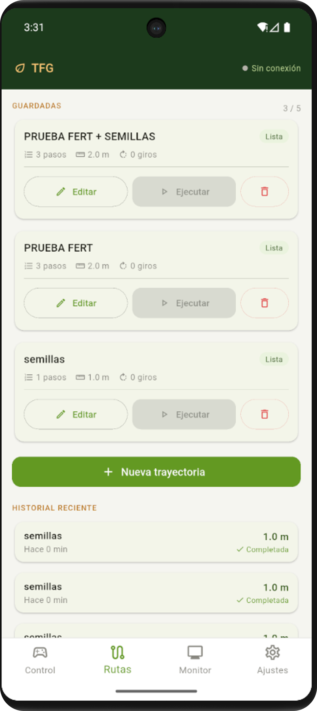
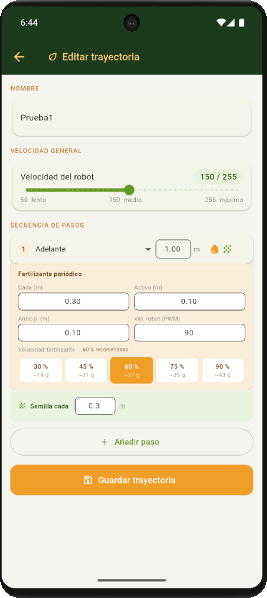
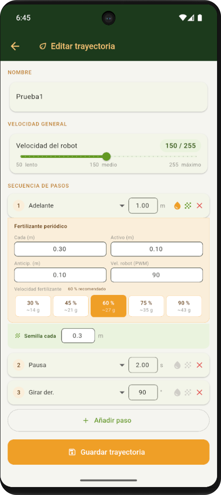
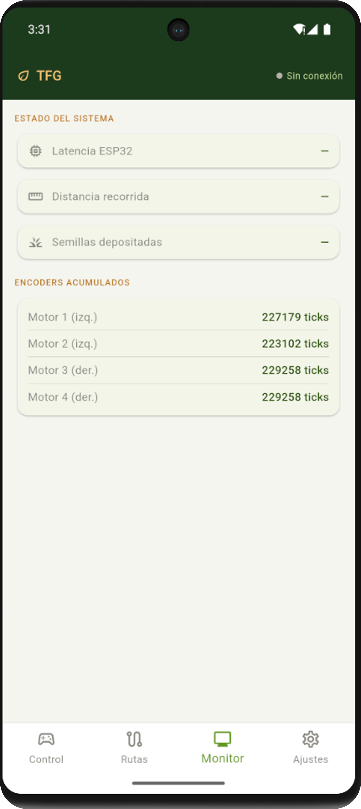
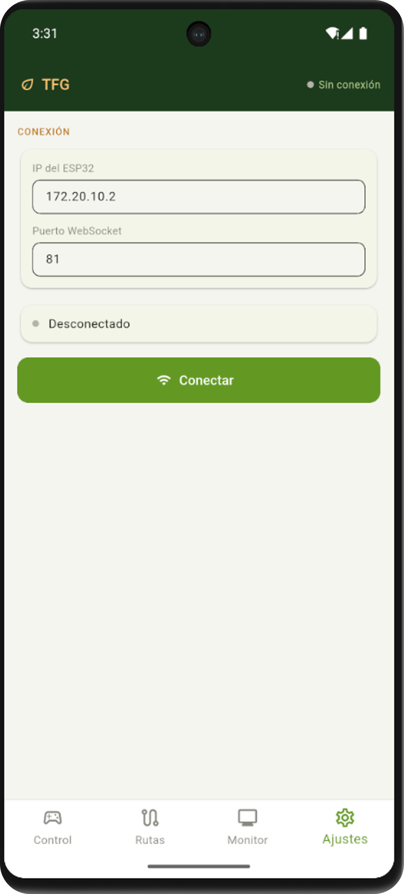

 

### _Robot agrícola de bajo coste para siembra y fertilización simultánea en cultivos en hileras_

 

 

> **Trabajo Fin de Grado** · Grado en Ingeniería Robótica · Universitat d'Alacant · Mayo 2026  
> **Autor:** Nicolás Fernández Blánquez · **Tutor:** Juan Marcos Llorca Schenk

---

## 🌱 Motivación

Este proyecto nace de haber visto a mi familia trabajar el campo día tras día. Un trabajo definido por un esfuerzo y un desgaste físico del cual he sido testigo desde pequeño. Si decidí estudiar ingeniería fue, en gran parte, para intentar devolver algo a ese entorno; poner la tecnología al servicio de quienes lo dieron todo por mí.

Con este prototipo no pretendo sustituir la esencia de la agricultura, sino dignificarla. Al delegar las tareas más pesadas, **el agricultor deja de ser una fuente de energía física para convertirse en un gestor de tecnología**.

---

## 📋 Descripción general

Prototipo funcional de robot agrícola autónomo capaz de realizar **siembra y fertilización granulada de forma simultánea** en cultivos organizados en hileras. El sistema completo incluye plataforma móvil 4WD, dos mecanismos de dosificación propios, electrónica de control sobre ESP32 y aplicación Android desarrollada en Flutter.

Todo el chasis y los mecanismos de dosificación se fabricaron íntegramente mediante **impresión 3D FDM** con filamento PLA y TPU, con un coste total de **313,78 €**, entre 10 y 160 veces inferior al de la solución comercial más económica del mercado.

---

## 🎬 Demo

Para una visión completa del proyecto, puedes reproducir el vídeo demostrativo con todo el funcionamiento detallado en YouTube:

---

## 🏗️ Arquitectura del sistema

## ⚙️ Subsistemas

### 🚗 Plataforma móvil — 4WD tracción integral

Configuración de cuatro ruedas motrices con **dirección diferencial**: dos pares de motores DC independientes, uno por lateral. El giro se produce variando la velocidad relativa entre laterales, eliminando cualquier mecanismo de dirección orientable.

| Parámetro | Valor |
|-----------|-------|
| Motores de tracción | JGB37-555-CE · 12 V · 88 RPM (sin carga) · reducción 90:1 |
| Encoders | Magnéticos integrados · **1440 pulsos/vuelta** |
| Resolución odométrica | **~37 810 ticks/metro** (cuadratura completa × 4 flancos) |
| Ruedas | TPU flexible · perfil V-tread · diámetro 100 mm |
| Driver | 2× BTS7960 · 43 A continuos |
| Chasis | PLA High Speed · FDM · patas de aluminio anodizado rectangular |

### 🌾 Dosificador de semillas — plato alveolar horizontal

Mecanismo de siembra de precisión: una placa giratoria con **4 alvéolos** captura una semilla de la tolva por ciclo, un enrasador garantiza singulación individual y la semilla cae por gravedad al surco en el punto exacto.

| Parámetro | Valor |
|-----------|-------|
| Motor | NEMA 17 · 17HS15-1504S-X1 · 42 Ncm |
| Driver | A4988 · calibrado a 1,35 A (Vref = 1,08 V) |
| Pasos por semilla | **50 pasos** (200 pasos/vuelta ÷ 4 alvéolos) |
| Cultivo de referencia | Judía enana variedad Strike · semillas 8–12 mm |
| Sincronización | Por odometría de encoders de tracción |

 

| 1. Montaje del dosificador de semillas | 2. Funcionamiento del dosificador de semillas |
|:--:|:--:|
|  |  |

### 🧪 Dosificador de fertilizante — tornillo sin fin

Tornillo helicoidal de 45° (sin soportes de impresión) dentro de carcasa cilíndrica. El caudal es **directamente proporcional a la velocidad de giro**, regulable en tiempo real desde la app.

| Parámetro | Valor |
|-----------|-------|
| Motor | JGB37-555 · 12 V · reducción 270:1 · 22 RPM (sin carga) |
| Driver | L298N · control PWM |
| Linealidad validada | **R² = 0,996** sobre 3 velocidades × 5 repeticiones |
| Masa dispensada | 14,4 g / 27,0 g / 42,8 g en 10 s (30 / 60 / 90% PWM) |

 

| 1. Montaje del dosificador de fertilizante | 2. Funcionamiento del dosificador de fertilizante |
|:--:|:--:|
|  |  |

### 📱 Aplicación móvil — Flutter / Dart

App Android nativa con comunicación WebSocket en tiempo real. Cuatro pestañas con funcionalidad completa de control, planificación y monitorización.

| Pestaña | Funcionalidad |
|---------|--------------|
| **Control** | Joystick direccional · sliders de velocidad · control independiente de dosificadores · lectura de encoders en tiempo real |
| **Rutas** | Creación, edición y ejecución de trayectorias predefinidas · configuración de dosificación por tramo · historial de ejecuciones |
| **Monitor** | Latencia WebSocket · distancia recorrida · semillas depositadas · ticks por encoder |
| **Ajustes** | IP del ESP32 · puerto WebSocket · gestión de conexión |

 

| 🕹️ Pantalla: Control | 🗺️ Pantalla: Rutas (Vista General) |
|:--:|:--:|
|  |  |

#### 🔄 Detalle del flujo en la sección de Rutas:

| 1. Creación/Lista de Rutas | 2. Editor de Trayectorias | 3. Historial de Ejecución |
|:--:|:--:|:--:|
|  |  |  |

 

| 📊 Pantalla: Monitor | ⚙️ Pantalla: Ajustes |
|:--:|:--:|
|  |  |

## 🔌 Electrónica

| Componente | Función | Especificación clave |
|------------|---------|----------------------|
| ESP32-DevKitC | Microcontrolador central | 240 MHz · WiFi + BT · 16 canales PWM |
| 2× BTS7960 | Driver tracción | 43 A · PWM 25 kHz |
| A4988 | Driver NEMA 17 | STEP/DIR · 1/16 micropaso |
| L298N | Driver fertilizante | 2 A cont · 3 A pico |
| LiPo 3S OVONIC | Batería principal | 11,1 V · 5200 mAh · 50C |
| LM2596 | Regulador buck | 11,1 V → 5 V / 3,3 V |
| XL6019 | Regulador boost | batería → 12 V estables |

---

## 📊 Resultados de validación

| Criterio | Umbral | Resultado | Estado |
|----------|--------|-----------|--------|
| Tasa de singulación de semillas | ≥ 80 % | **55 %** | ❌ |
| Linealidad dosificación fertilizante | R² ≥ 0,95 | **R² = 0,996** | ✅ |
| Desviación lateral en trayectoria | ≤ 100 mm | **125 mm máx.** | ❌ |
| Control remoto vía app | Sin intervención física | **Funcional** | ✅ |
| Funcionamiento integrado en tierra | Operación simultánea | **Completado** | ✅ |

**Causa identificada — singulación:** ajuste insuficiente del enrasador respecto al disco, permitiendo paso lateral de semillas. Corregible mediante rediseño de la tolerancia de ajuste.

**Causa identificada — deriva lateral:** desalineación mecánica entre el sistema de tracción y el chasis. Corregible reposicionando las patas respecto al chasis.

---

## 💰 Presupuesto

| Partida | Coste |
|---------|-------|
| Componentes electrónicos y materiales | 267,64 € |
| Fabricación por impresión 3D (filamento + tiempo) | 46,14 € |
| **Total** | **313,78 €** |

## 🛠️ Stack tecnológico

- **Microcontrolador:** ESP32 · Arduino IDE 2.3.7 · `WiFi.h` · `WebSocketsServer.h` · `ArduinoJson.h`
- **App móvil:** Flutter / Dart · WebSocket · Android
- **CAD:** Autodesk Inventor Professional 2026
- **Laminado:** PrusaSlicer 2.9.4
- **Esquemas electrónicos:** Fritzing 1.0.4
- **Fabricación:** Impresión 3D FDM · PLA High Speed + TPU · Creality CR-10 Smart

## 🔭 Líneas futuras

- Rediseño del enrasador para corregir la tasa de singulación
- Corrección de alineación chasis-tracción para reducir la deriva lateral
- Integración de GPS-RTK para navegación autónoma por surcos
- Sensores de ultrasonidos / LiDAR para detección de obstáculos
- Visión artificial para detección de maleza y monitorización de cultivo
- Ampliación del chasis para mejor distribución de electrónica

---

## 📚 Contexto académico

**Tipo:** Trabajo Fin de Grado  
**Titulación:** Grado en Ingeniería Robótica  
**Centro:** Escuela Politécnica Superior · Universitat d'Alacant  
**Tutor:** Juan Marcos Llorca Schenk  
**Fecha de defensa:** Mayo 2026   

---

_«No sé cómo le pareceré al mundo, pero a mí me parece que he sido como un niño jugando en la orilla del mar, entretenido en encontrar de vez en cuando un guijarro más liso o una concha más bonita, mientras el gran océano de la verdad yacía inexplorado ante mí.»_

— Isaac Newton

